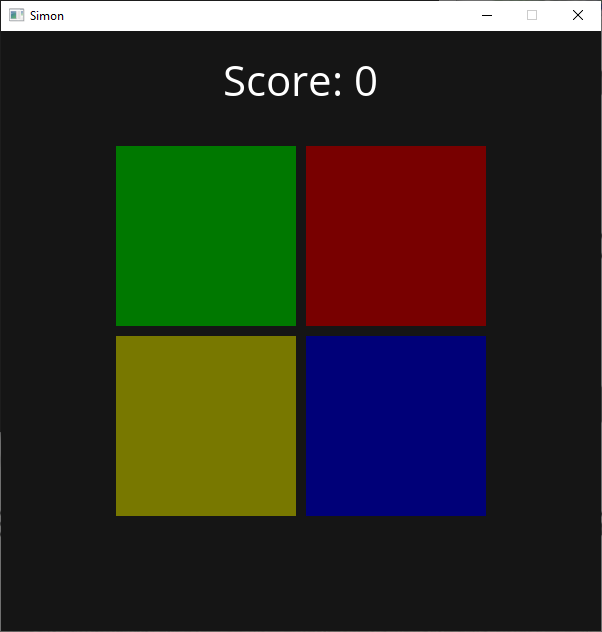

# Simon

Simon is a memorization game with colored buttons. This game is made with C++ and [Wase Engine](https://github.com/Wase-Engine/wase-engine)




## Setting up Simon

Requirements:

 - CMake
 - [Wase Engine](https://github.com/Wase-Engine/wase-engine)
 - SDL2
 - SDL2 image
 - SDL2 mixer
 - SDL2 ttf
 - C++17 or higher

You can use the CMake GUI or you can run the following commands in the commandline:
```
mkdir build
cd build
cmake .. -D WASE_ENGINE_INCLUDE_DIR=path -D WASE_ENGINE_LIBRARIES=path
cmake build .
```
